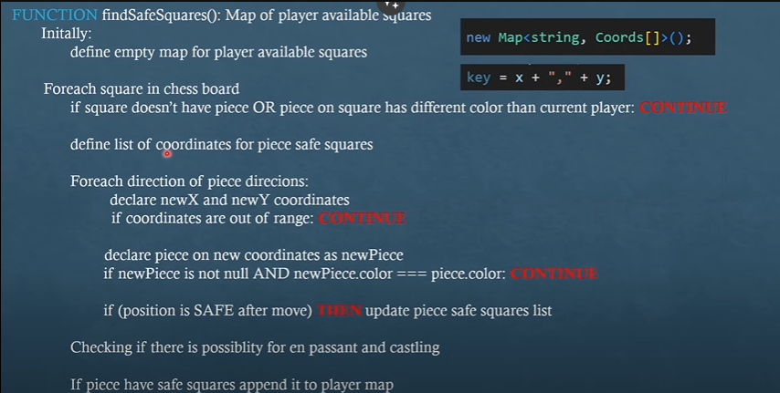
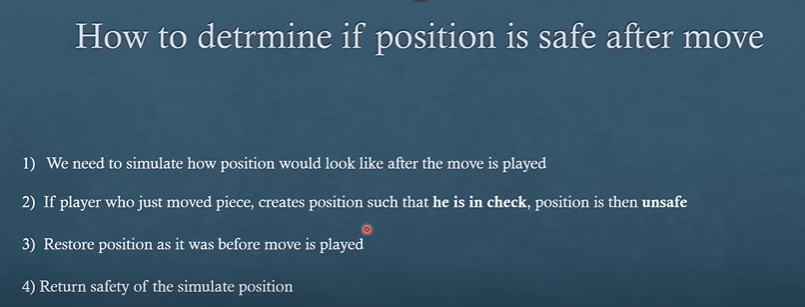
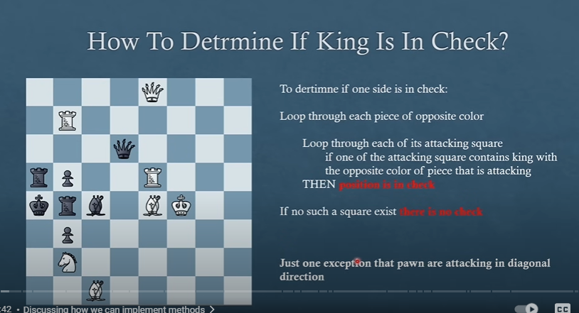

# chess

# OOP nature

## Board

1. chessBoard: 2d matrix of pieces
2. playerColor: signals turn
3. chessBoardView:

## Pieces

1. FENchar: representation of piece
   | piece | white | black |
   |:------: |:-----: |:-----: |
   | KING | K | k |
   | QEEN | Q | q |
   | ROOK | R | r |
   | BISHOP | B | b |
   | KNIGHT | N | n |
   | PAWN | P | p |
2. color: w or b
3. direction: Coord(x,y)

-   x: RANK
-   y: BOARD_FILE
-   

## En Passant

> Conditions

1. prevPlayer moved the exchanging pawn 2 squares
2. both pawn are on same rank(x)
3. adjecent to each other
4. position must be safe after the exchange(no check)
